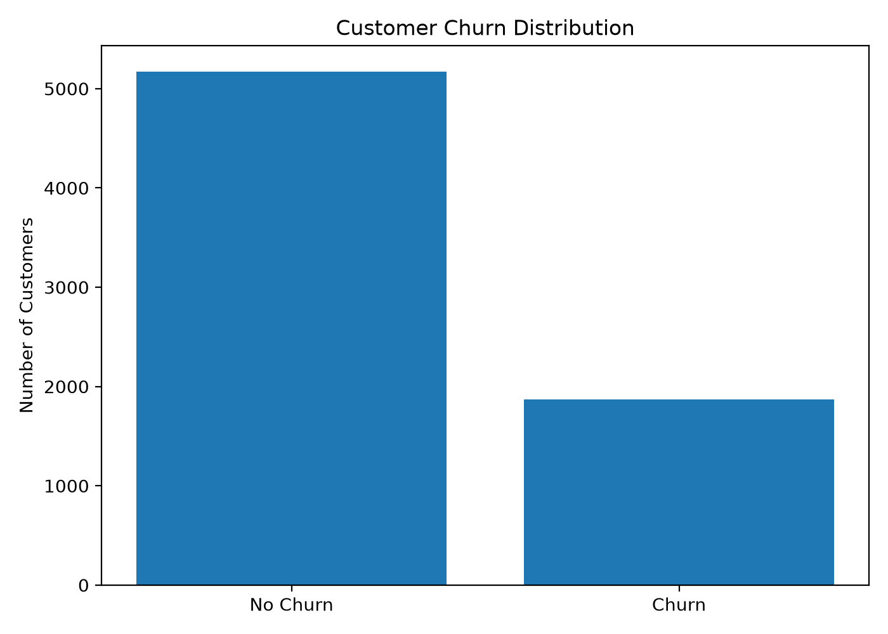
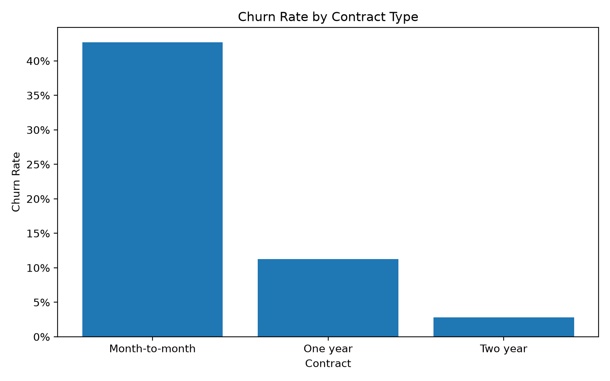
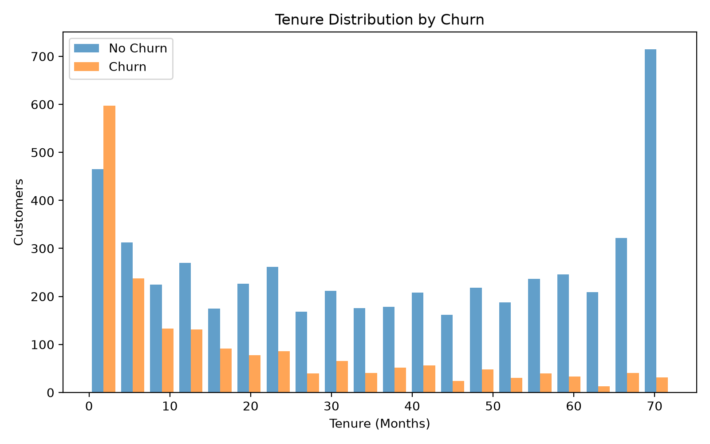
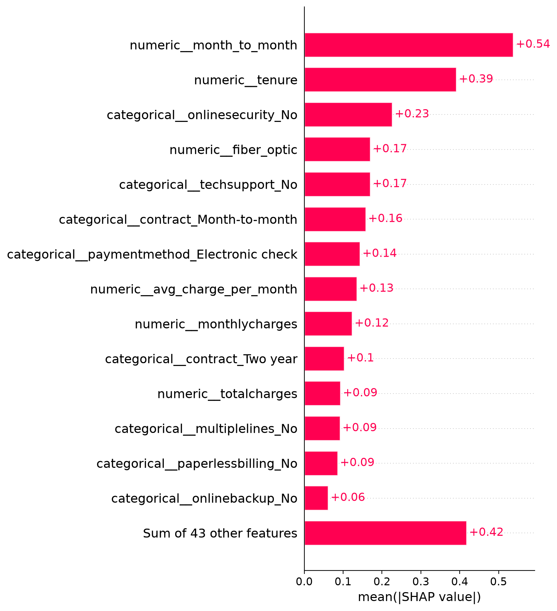
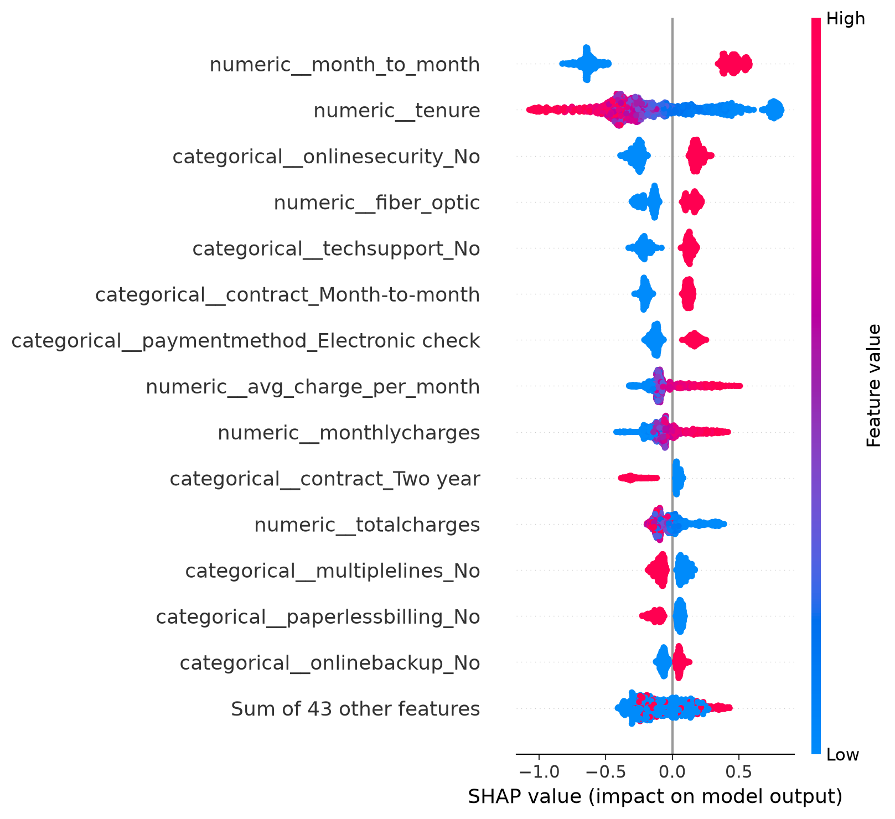
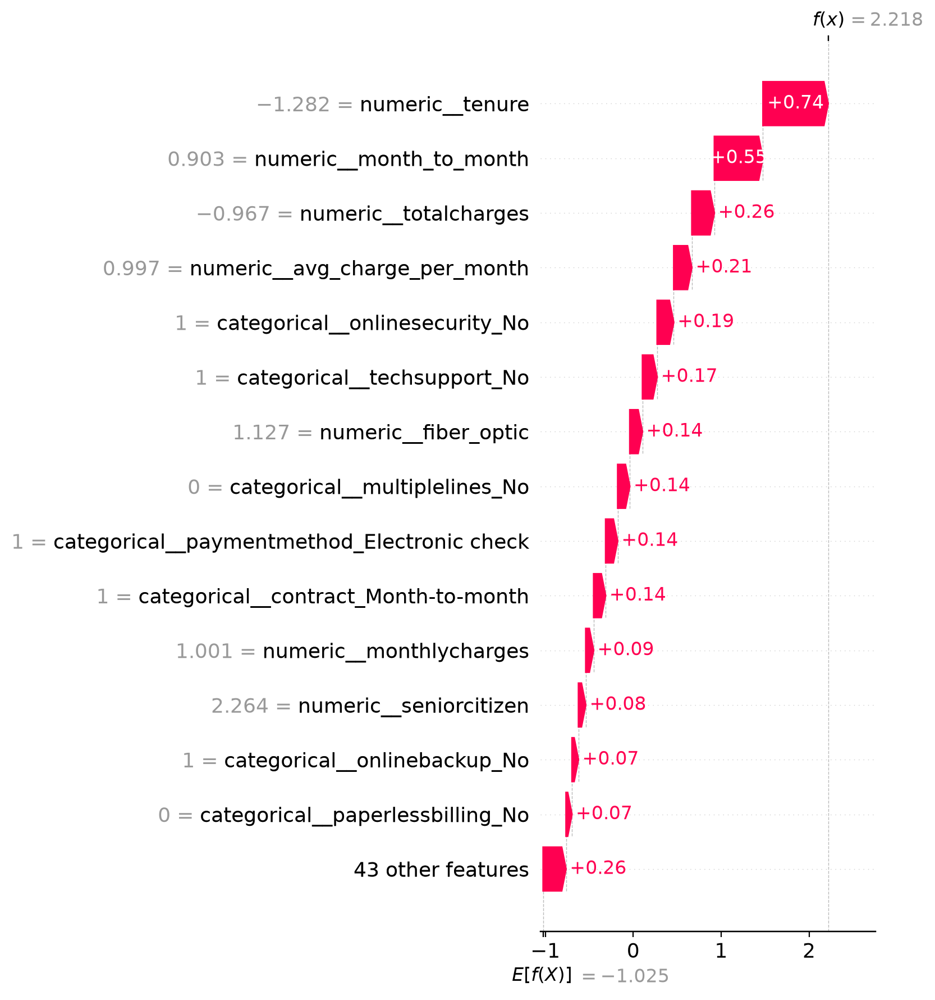

# Customer Intelligence ML Platform

[](https://github.com/MuskaanBashal/Customer-Intelligence-ML-Platform/actions/workflows/ci.yml)

An end-to-end machine learning platform for predicting telecommunications customer churn, explaining individual predictions, serving predictions through a REST API, monitoring data drift, and providing an interactive business-facing dashboard.

The project demonstrates the complete machine learning lifecycle — from raw data ingestion and preprocessing through model development, evaluation, explainability, deployment, testing, containerisation, and continuous integration.

## Project Overview

Customer churn is a major challenge for subscription-based businesses. Identifying customers who are likely to leave allows retention teams to prioritise interventions before churn occurs.

This project builds a production-oriented churn prediction system using the IBM Telco Customer Churn dataset.

The platform includes:

- Automated data ingestion and validation
- Data preprocessing and feature engineering
- Exploratory data analysis
- Logistic Regression, Random Forest and XGBoost model comparison
- Hyperparameter tuning using cross-validation
- Decision-threshold optimisation
- Locked held-out test evaluation
- SHAP-based global and customer-level explainability
- FastAPI prediction service
- Streamlit interactive dashboard
- Data drift monitoring using Population Stability Index (PSI)
- Automated API and feature-engineering tests
- Docker and Docker Compose deployment
- GitHub Actions continuous integration

## System Architecture

```text
                    Raw Customer Data
                           |
                           v
                 Data Ingestion & Validation
                           |
                           v
                      Preprocessing
                           |
                           v
                   Feature Engineering
                           |
                           v
              Model Training & Comparison
                  /        |        \
                 /         |         \
        Logistic      Random Forest    XGBoost
                 \         |         /
                  \        |        /
                    Model Selection
                           |
                           v
                 Hyperparameter Tuning
                           |
                           v
                 Threshold Optimisation
                           |
                           v
                  Locked Test Evaluation
                           |
                           v
                  Production Model
                     /           \
                    /             \
             FastAPI API      SHAP Explainer
                    \             /
                     \           /
                   Streamlit Dashboard
                           |
                           v
                    Customer Risk
                      Prediction

             Monitoring: PSI Drift Detection
             Testing: Pytest
             Deployment: Docker Compose
             CI: GitHub Actions
```

## Model Performance

The final XGBoost model was evaluated once on a locked held-out test set after model selection, hyperparameter tuning and threshold selection were completed using training and validation data.

| Metric | Held-Out Test Result |
|---|---:|
| ROC-AUC | **0.8473** |
| PR-AUC | **0.6632** |
| Accuracy | **0.7835** |
| Precision | **0.5726** |
| Recall | **0.7273** |
| F1 Score | **0.6408** |
| Decision Threshold | **0.35** |

The **0.35 decision threshold** was selected using out-of-fold predictions on the training data to optimise F1 score. The locked test set was not used for threshold selection.

### Confusion Matrix

| | Predicted Non-Churn | Predicted Churn |
|---|---:|---:|
| **Actual Non-Churn** | 832 | 203 |
| **Actual Churn** | 102 | 272 |

The selected threshold increases sensitivity to customers at risk of churn compared with the conventional 0.50 threshold. In the held-out test set, the model identified **272 of 374 churn customers**, corresponding to a recall of **72.73%**.

## Dataset

The project uses the **Telco Customer Churn** dataset, containing customer demographics, account information, subscribed services, billing information and churn status.

The dataset contains:

- **7,043 customer records**
- **21 original columns**
- Binary churn target (`Yes` / `No`)
- Overall churn rate of approximately **26.54%**

During preprocessing, `TotalCharges` was converted from text to numeric format. Eleven customers had missing `TotalCharges`; all had zero tenure, indicating newly registered customers without accumulated historical charges. These values were therefore set to zero.

Customer IDs are retained for traceability but excluded from model features.

## Exploratory Data Analysis

EDA identified several strong associations with customer churn:

- **Month-to-month contracts:** 42.71% churn
- **One-year contracts:** 11.27% churn
- **Two-year contracts:** 2.83% churn
- **Fiber optic customers:** 41.89% churn
- **DSL customers:** 18.96% churn
- **Electronic check customers:** 45.29% churn

Customers who churned also had lower average tenure and higher average monthly charges than customers who remained.

These findings describe associations in the dataset and should not be interpreted as causal relationships.

### Churn Distribution



### Churn by Contract Type



### Tenure by Churn



## Feature Engineering

Eight additional customer-level features were engineered:

| Feature | Description |
|---|---|
| `tenure_group` | Groups customers into tenure ranges |
| `num_services` | Number of active telecommunications services |
| `automatic_payment` | Whether the customer uses automatic payment |
| `month_to_month` | Indicator for month-to-month contracts |
| `fiber_optic` | Indicator for fiber optic internet |
| `has_internet` | Whether the customer has internet service |
| `has_tech_support` | Whether technical support is enabled |
| `avg_charge_per_month` | Historical charges divided by tenure |

Feature engineering is implemented through a shared function used by both the data pipeline and prediction API, reducing the risk of training-serving skew.

## Model Development

Three classification algorithms were compared using **5-fold cross-validation** on the training data.

| Model | ROC-AUC | PR-AUC | F1 |
|---|---:|---:|---:|
| Logistic Regression | 0.8473 | 0.6627 | 0.5969 |
| XGBoost | 0.8434 | 0.6604 | 0.5762 |
| Random Forest | 0.8253 | 0.6224 | 0.5489 |

Logistic Regression provided the strongest initial cross-validation ROC-AUC. XGBoost was subsequently hyperparameter-tuned and achieved a cross-validation ROC-AUC of **0.8501**, compared with **0.8478** for the tuned Logistic Regression model.

The tuned XGBoost model was therefore selected for final evaluation.

### Selected XGBoost Configuration

```python
n_estimators=200
max_depth=3
learning_rate=0.03
subsample=0.8
colsample_bytree=0.8
```

## Explainable AI with SHAP

SHAP is used to explain both overall model behaviour and individual customer predictions.

Global SHAP analysis helps identify which features have the greatest influence on the XGBoost model. Important model features included contract type, tenure, online security, fiber optic internet, technical support, payment method and customer charges.

### Global Feature Importance



### SHAP Beeswarm



### Example Customer Explanation



For individual predictions, the API returns the most influential SHAP factors alongside the churn probability. SHAP values represent contributions to the model output and should not be interpreted as causal effects.

## Prediction API

A REST API built with **FastAPI** exposes the trained model for real-time inference.

The API:

- Validates customer inputs using Pydantic
- Applies the same feature-engineering logic used during training
- Loads the complete preprocessing and XGBoost pipeline
- Generates churn probabilities
- Applies the selected 0.35 decision threshold
- Returns the predicted churn classification
- Generates customer-level SHAP explanations

### API Endpoints

| Endpoint | Method | Purpose |
|---|---|---|
| `/` | GET | API information |
| `/health` | GET | Service health check |
| `/predict` | POST | Generate churn prediction and explanation |

Example prediction output:

```json
{
  "churn_probability": 0.7845,
  "churn_probability_percent": 78.45,
  "decision_threshold": 0.35,
  "predicted_churn": 1,
  "risk_level": "HIGH",
  "top_model_factors": [
    {
      "feature": "numeric__month_to_month",
      "shap_value": 0.5729,
      "direction": "higher"
    }
  ]
}
```

## Interactive Streamlit Dashboard

A Streamlit application provides a business-facing interface for interacting with the prediction API.

Users can enter customer characteristics and receive:

- Predicted churn probability
- Classification threshold
- Churn risk classification
- Top model factors influencing the prediction
- SHAP-based explanation of model behaviour

The dashboard communicates with the FastAPI service through HTTP rather than loading the ML model directly. This keeps the user interface and inference service separated.

## Drift Monitoring

The project includes a basic monitoring component using **Population Stability Index (PSI)** to detect changes in numerical feature distributions.

The monitoring pipeline evaluates:

- `tenure`
- `monthlycharges`
- `totalcharges`
- `num_services`
- `avg_charge_per_month`

A controlled simulation was used to verify that the monitoring component can detect substantial distribution shifts. This simulation is an engineering demonstration and does **not** represent observed production drift.

Example simulated results:

| Feature | PSI | Status |
|---|---:|---|
| tenure | 1.5991 | HIGH |
| monthlycharges | 0.9828 | HIGH |
| num_services | 0.0090 | LOW |
| avg_charge_per_month | 0.0088 | LOW |
| totalcharges | 0.0037 | LOW |

The generated report is stored in `docs/drift_report.csv`.

## Automated Testing

The project uses **pytest** to test both API behaviour and feature-engineering logic.

The test suite covers:

- API root and health endpoints
- Valid model predictions
- Prediction probability bounds
- SHAP explanation output
- Invalid API inputs
- Feature-engineering calculations
- Zero-tenure handling
- Model input schema
- Training-serving feature parity

The current suite contains **14 automated tests**.

Run the tests with:

```bash
pytest -q
```

## Containerisation

The API and Streamlit dashboard are containerised separately using Docker.

`docker-compose.yml` orchestrates both services:

```text
Browser
   |
   v
Streamlit Dashboard :8501
   |
   | HTTP
   v
FastAPI Service :8000
   |
   v
XGBoost Pipeline + SHAP
```

Start the complete application with:

```bash
docker compose up --build
```

The services are then available locally at:

- Streamlit dashboard: `http://localhost:8501`
- FastAPI service: `http://localhost:8000`
- FastAPI documentation: `http://localhost:8000/docs`

## Continuous Integration

GitHub Actions runs automated validation whenever changes are pushed to `main` or submitted through a pull request.

The CI workflow:

1. Checks out the repository
2. Configures Python 3.13
3. Installs project dependencies
4. Runs the complete pytest suite

This helps detect regressions before changes are incorporated into the project.

## Technology Stack

| Area | Technologies |
|---|---|
| Language | Python |
| Data Processing | pandas, NumPy |
| Machine Learning | scikit-learn, XGBoost |
| Explainability | SHAP |
| API | FastAPI, Pydantic, Uvicorn |
| Dashboard | Streamlit |
| Monitoring | Population Stability Index |
| Testing | pytest |
| Containerisation | Docker, Docker Compose |
| CI | GitHub Actions |
| Version Control | Git, GitHub |


## Project Structure

```text
customer-intelligence-ml-platform/
├── api/
│   ├── main.py
│   └── schemas.py
├── app/
│   └── dashboard.py
├── data/
│   ├── raw/
│   └── processed/
├── docs/
│   ├── figures/
│   └── drift_report.csv
├── models/
│   ├── churn_xgboost_pipeline.joblib
│   └── model_metadata.joblib
├── src/
│   ├── ingestion/
│   ├── preprocessing/
│   ├── features/
│   ├── training/
│   ├── evaluation/
│   └── monitoring/
├── tests/
├── .github/
│   └── workflows/
│       └── ci.yml
├── Dockerfile
├── Dockerfile.streamlit
├── docker-compose.yml
├── requirements.txt
└── README.md
```

## Running the Project

### 1. Clone the Repository

```bash
git clone https://github.com/MuskaanBashal/Customer-Intelligence-ML-Platform.git
cd Customer-Intelligence-ML-Platform
```

### 2. Create a Virtual Environment

```bash
python3 -m venv .venv
source .venv/bin/activate
```

### 3. Install Dependencies

```bash
python -m pip install --upgrade pip
pip install -r requirements.txt
```

### 4. Run Automated Tests

```bash
pytest -q
```

### 5. Start the FastAPI Service

```bash
uvicorn api.main:app --reload
```

The interactive API documentation is available at:

```text
http://127.0.0.1:8000/docs
```

### 6. Start the Streamlit Dashboard

Open a second terminal, activate the virtual environment, and run:

```bash
streamlit run app/dashboard.py
```

The dashboard is available at:

```text
http://localhost:8501
```

### Run with Docker Compose

Alternatively, the API and dashboard can be started together:

```bash
docker compose up --build
```

Docker Compose starts:

- FastAPI on port `8000`
- Streamlit on port `8501`
- Internal communication from Streamlit to the API through the Docker network


## Evaluation Methodology

The project uses a structured evaluation strategy to reduce data leakage and provide a realistic estimate of model performance.

1. The dataset was split using a stratified **80/20 train-test split**.
2. The 20% test set was locked and excluded from model development.
3. Logistic Regression, Random Forest and XGBoost were compared using **5-fold cross-validation** on the training data.
4. Hyperparameter tuning was performed without using the locked test set.
5. Out-of-fold predictions from the training data were used for decision-threshold analysis.
6. A threshold of **0.35** was selected based on F1 score.
7. The selected XGBoost configuration was evaluated once on the locked test set.
8. After evaluation was complete, the fixed production pipeline was retrained on all available labelled data for deployment.

The performance metrics reported in this README are from the locked held-out test evaluation rather than the final full-data production training run.

## Limitations

This project is a production-oriented portfolio implementation rather than a live telecommunications production system.

Current limitations include:

- The dataset is historical and public rather than live operational customer data.
- The 0.35 threshold optimises F1 score rather than a company-specific financial cost function.
- SHAP values explain model behaviour but do not establish causal relationships.
- Some engineered variables overlap conceptually with original features, which can distribute SHAP importance across correlated features.
- PSI monitoring currently demonstrates simulated drift rather than monitoring a live production stream.
- The platform does not currently include automated model retraining or a model registry.
- Production authentication, rate limiting and observability are outside the current scope.

## Future Improvements

Potential extensions include:

- Probability calibration and calibration monitoring
- Business-cost-based threshold optimisation
- Live prediction and feature-drift telemetry
- Automated retraining pipelines
- Experiment tracking and model registry integration
- Cloud deployment
- API authentication and rate limiting
- Batch prediction endpoints
- Formal production data contracts
- Model and service observability dashboards

## Author

**Muskaan Bashal**

Master of Information Technology — Data Science & Artificial Intelligence

Interests: Data Science, Machine Learning, Data Analytics and production-oriented ML systems.
